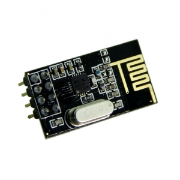
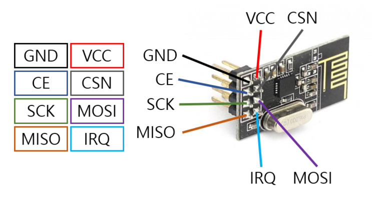

# 시그널보내~시그널보내~ 찌릿찌릿찌릿(RF모듈)

   
    
    
 이전에 썼던 블루투스 모듈은 1대 1통신이자 근거리 통신이라는 단점이 있다. 하지만 우리는 신호를 멀리 그리고 Multi 통신을 하고 싶다.
 그렇다면 우리가 어떤 통신을 써야할까? 하지만 쓰기 위해서는 먼저 어떤 통신을 사용할지 결정해야 한다. 저번처럼 가깝고 근접한 IoT와 연결 하기 위해서는
 블루투스를 사용하지만 무선 통신에는 정말 많은 것들이 있고 여러 프로토콜이 존재한다. 적외선 통신, NFC, Wifi, RF 통신, LoRa,
 Zigbee, 3G/LTE 등이 존재하고 최근에 5G 통신망이 나왔다. 우리가 흔히 볼 수있는 찌릿찌릿한 통신을 쓰는 것은 트와이스 시그널 아...아니 Radio를 예로 들 수 있다.
 위의 통신들은 전부 특성이 있고 서로 상황에 맞는 무선 통신 서비스를 사용한다. 이번에는 RF(Radio Frequency)모듈을 사용할 예정이다.  
 　  
   
우리가 사용하려고하는 RF모듈은 nRF24L01P 모듈로 2.4G 주파수 영역을 사용한다. 또한 1 그리고 2Mbps의 데이터 전송 속도를 가지고
GFSK modulation 방식이다. 뭐 이렇게 어려운 말들은 그만 하겠다.  
   
 어려운말 그만한다고 했지만 또 어려운 부분들이 많다. 여기서 CE, CSN부분은 마음대로 핀번호를 설정하여 사용하면 된다. 하지만 
 SPI 커뮤니케이션을 위해서 사용하는 핀은 11(MOSI), 12(MISO), 13(SCK) 3개는 항상 동일하게 꼽아야한다. 이 이류를 묻는다면
 처음에 [Arduino_basic](https://github.com/alscjf909/Arduino_basic) 에서 설명하였다. 이것을 보고도 모른다고 하면  
    
 음..그건 약속이니깐....
 　 