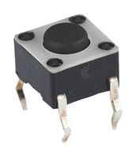
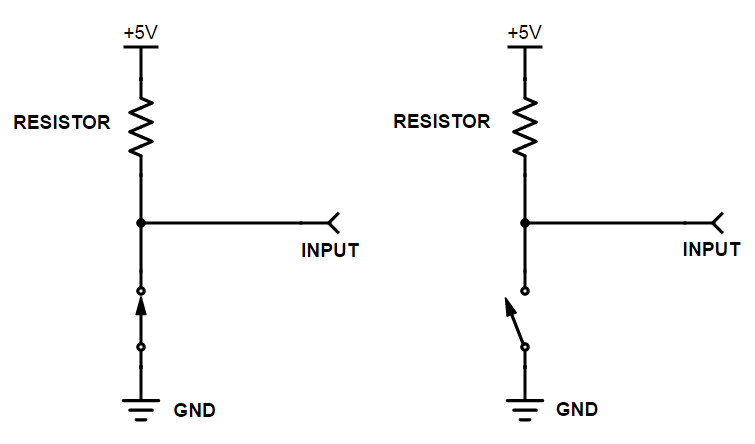

# 닌텐도 (스위치) 모듈
제어 할 때 가장 쉽고 빠른 방법은 무엇이 있을까? 그 방법은 전원을 끊는 것이다. 전원을 끊게되면
전류 전압 이런거 신경 쓸 필요 없다. 그냥 꺼버리는 것이다. 이렇게 무식하고 원초적인 방법이 
가자 좋을 때가 있다. 예를 들어 잘려고 방에 불을 끌때 소리를 질러서 몇 dB이상 넘어야 꺼지고 휴대폰을 통해
블루투스로 연결하여 off 신호를 보내야 꺼지는 이러한 복잡한 방식보다 그냥 딸깍한번이면 꺼지는 스위치를
우리는 사용하고 있다. 이러한 스위치는 많은 부분에서 사용되어 진다. 또한 스위치로 on off를 1과 0으로 생각하면
스위치르 두개를 사용하면 00, 01, 10, 11 즉 4가지의 명령어를 사용 할 수 있게 된다. 이처럼 일상생활에서 흔히 
접할 수 있는 제어 장치의 기본 적인 원리를 알아보고 실험을 통해 스위치에 적응해보자.  
　  
　  
  
스위치는 기본적으로 위 사진과 같이 두가지의 형태로 되어 있다. 스위치를 작동 하였을 때 전류를 흘러주는 A 타입과
작동시 전류를 차단하는 B 타입이 있다. 이것 또 SPST(Single-pole Single-Throw), SPDT(Single-pole Double-Throw), DPST(Double-pole Single-Throw), DPDT(Double-pole Double-Throw)이
네가지 접점 종류로 나뉘어져 있고 회로 목적에 맞게 접점 타입을 선택하여 사용한다.  
  　  
또한 이런 on, off를 하는 방법으로 스위치 종류가 나누어진다. 여기에는 푸쉬스위치, 택트스위치, 토글스위치, 슬라이드 스위치,
라커스위치, 딥스위치, 로터리 스위치 등등이 있다. 이러한 것들 또한 회로 목적에 따라 사용하는 것들이 다르다. 우리는 이 중에서
푸쉬스위치, DTST를 사용 할 것이다.  
　  
   
　  
위에서 입력을 사용하기 위해서는 (출력, 입력) (A,B), (C,D), (A,C), (B,D) 연결을 사용해야한다. (A,D)연결이나 (B,C)연결로 해놓으면
바로 접지 되어있어 단지 전선으로 밖에 안된다. 이 때 우리가 아두이노에서 스위치를 푸쉬했는지 안했는지를 알기 위해 코드를 사용할 수 있다.   
  　
  
```
void setup() {
    pinMode(sw1, INPUT_PULLUP);
}   
```
　  

이렇게 사용 할 수 있는데 이때 INPUT_PULLUP대신 INPUT만 사용하여도 되지만, INPUT만 사용할 경우 회로적으로 풀업저항을
 만들어 주어야한다. 이는 플로팅 현상을 방지하고 달아 주는 것이다. 그러므로 INPUT_PULLUP을 사용하여 
 아두이노 자체적인 풀업저항을 사용하면 편리하다. 이때 풀업저항이 무엇인지를 생각 해봐야한다.  
　  
  
　  

이부분에서 스위치를 누르지 않을 경우 전기적인 신호를 보낼 수 있지만 스위치를 누르면 GND로 전류가 흐르게 되어
신호가 흐르지 않게 된다. 이를 이용하여 아두이노에 전기신호가 들어오면 이것을 if 문이나 case 문을 통해 다른
작업을 수행하게 가능하다. 이제 설명은 끝나고 이를 통해 여러가지를 실험 해보겠다.  
　  
### 실험내용
***
1. 스위치를 통해 시리얼 모니터에 데이터 입력 눈으로 확인하기  
2. 스위치를 통해 LED 켜고 끄기   
　  
### 준비물 
***
아두이노, 브레드보드, 점퍼선, LED 2개, 저항 2개, 퓌시버튼 스위치 2개  
　  
실험 1. 스위치를 통해 시리얼 모니터에 데이터 입력 눈으로 확인하기
　  
  
　  
실험 2. 스위치를 통해 LED 켜고 끄기  
　  
   
